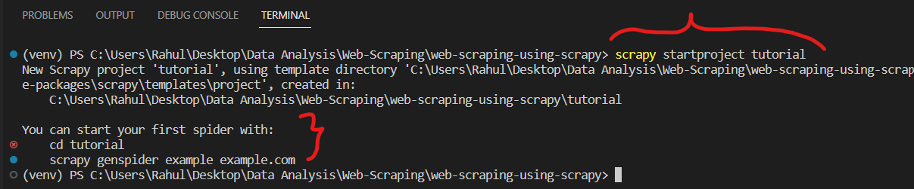
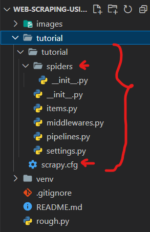
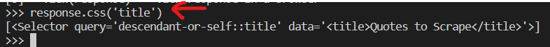
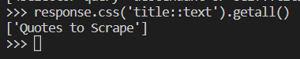
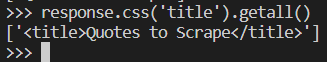
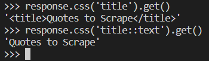
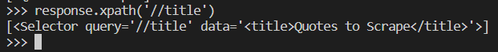
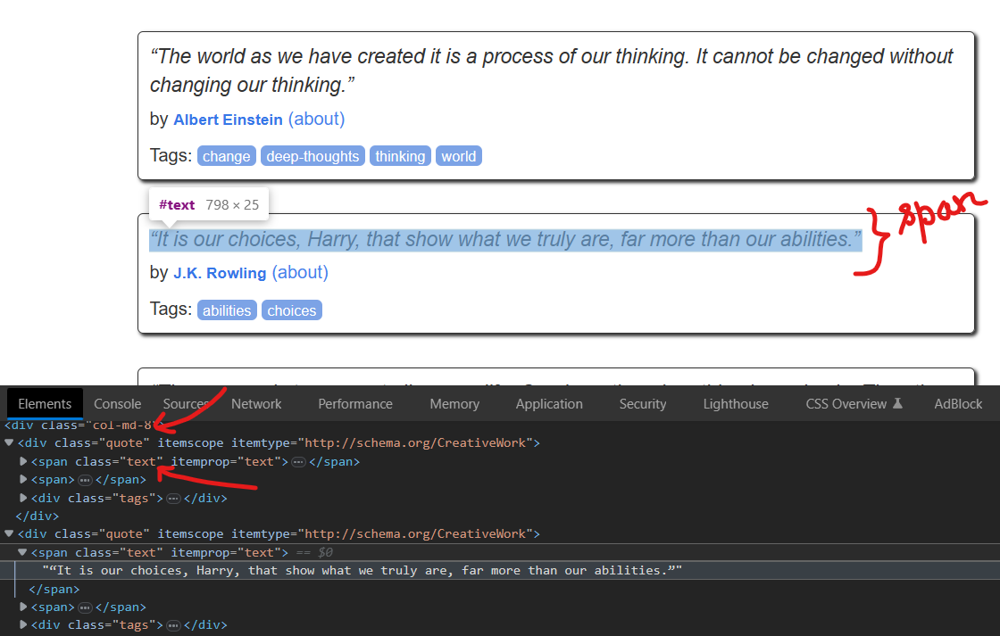
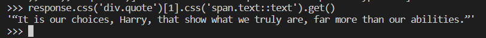

# Web Scraping using Scrapy

~ A simple web scraping code using ```scrapy```, a python framework to extract important and useful data for our needs.

## Setup | Commands
- First create a python environment to avoid interferring with original python installed on our system
```
pip install virtualenv
```
- Now rename that virtualenv with venv(virtual environment)
```
virtualenv venv
```
Note: This will create a new folder containing python virtaul env named ```venv```

- Now install necessary packages required for the project. In this project I need ```Scrapy``` python package.
```
pip install scrapy
```
Note: Before running above command, first activate the venv, as shown below
```
.\venv\Scripts\activate.ps1 (press enter)
```
- To see if its correctly installed
```
pip show scrapy
```

- Lets create our first project directory
```
scrapy startproject <folderName/ProjectName>
```


- After this a ```tutorial``` folder is created having subfolder with same name as shown <br>


Note: 
1. ```scrapy.cfg``` : This file is used for deploying configuration file
2. ```__init__.py``` : This file is projects python module
3. ```items.py``` : This file is projects item defination file 
4. ```middlewares.py``` : It is the project middleware file
5. Similarly, we have ```pipelines.py``` & ```settings.py``` files as well.

6. Inside, ```spiders``` folder there is ```__init__.py``` file where later on we will put our spiders!

## Create Spiders
- Lets create a spider with file name  ```spider1.py``` and write some code i.e subclass and give unique name to that spider and create some functions viz. start_requests and parse

- After this head over to ```tutorial``` directory using ```cd``` and crawl our spider as shown(i.e bring our created spider in action)
```
cd .\tutorial\
scrapy crawl quotes
```
Note: 
- ```quotes``` is the name of our spider
- After running ```scrapy crawl quotes``` , this will create two files named ```quotes-1.html``` & ```quotes-2.html``` where all the html data of that site will be present.

## Scrapy Shell 
- the best way to extract data with scrapy is trying selector using the scrapy shell
```
scrapy shell "http://quotes.toscrape.com/page/1"
```
- After this we can try selecting elements using css with ```response``` object
 
- List of selector objects that wrap around xml and html elements

- to extract the text of the title(all at once as list form) above
```
response.css('title::text').getall() 
```


- Other way to get html title <br>


- If we need to just extract title, the first one only


- We can use xpath as well instead of css used above. xpath expressions are very powerfull and foundation of scrapy selectors. Also css selector gets converted to xpath selector under the hood.


#### Other scrapy shell operations for practice
- devtools to analyze which text to select<br>

- scrapy shell code <br>

<br>

- Here we have applied the css in a way we used to do in css file as selector(to target particular element)
 

- scraping will become much easier if we know xpath.

## To extract all quotes using our spider named ```quotes```

- First run our spider using the command as shown below
```
scrapy crawl quotes
```

- Then we will extract all relevent data and store it in ```quotes.json``` file as output
```
scrapy crawl quotes -o quotes.json
```
This will create quotes.json file containing all quotes, authors, tags for all quotes

- Instead of json we could have a csv file name as well with output as ```quotes.csv``` file
```
scrapy crawl quotes -o quotes.csv
```
This will create quotes.csv file containing all data about quotes i.e authors, tags
